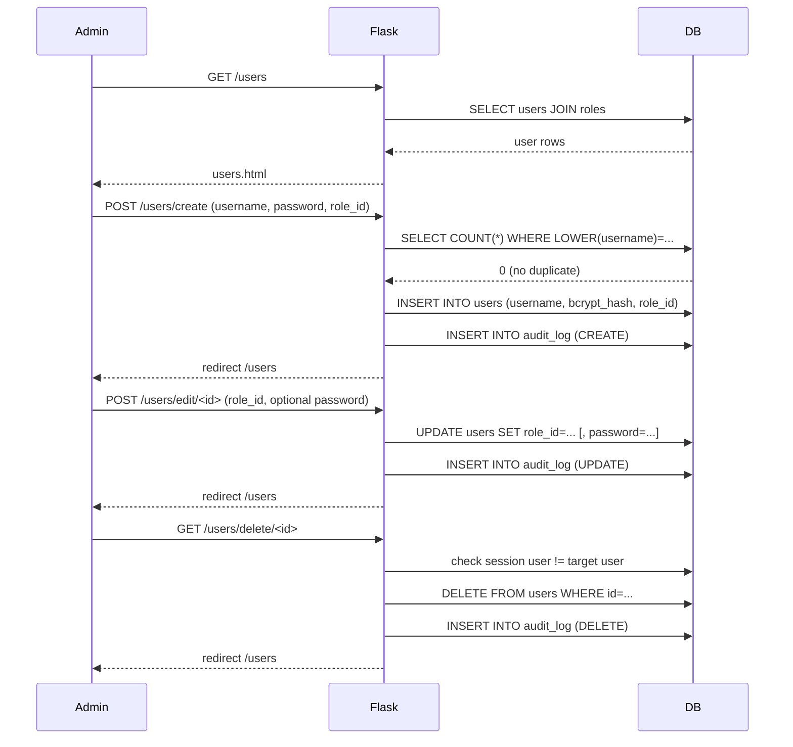
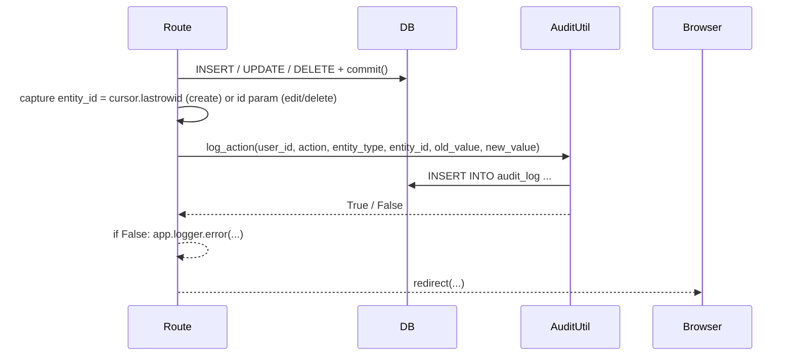
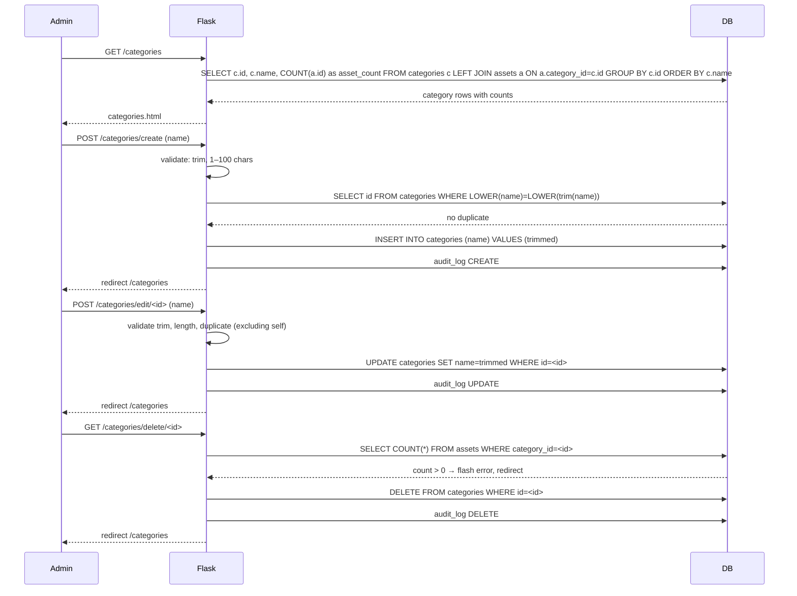

# Design Document: app-improvements

## Overview

This document covers four targeted improvements to the existing Flask + PyMySQL + Jinja2 IT Asset Management application. All four features are additive — they introduce new routes, extend existing routes, and add new templates while preserving all current behaviour. The implementation language is Python (Flask), with raw SQL via PyMySQL and plain-JS Jinja2 templates matching the project's existing conventions.

---

## Architecture

The application is a single-file Flask app (`app.py`) backed by a MySQL database accessed through `database.py` (`get_connection()`). An audit utility module (`app_utils.py`) exposes `log_action()`, and `rbac.py` contains `RBACManager` with its own `audit_log()` method. All four improvements operate within this existing structure — no new frameworks, ORMs, or external services are introduced.

```mermaid
graph TD
    Browser -->|HTTP| Flask["app.py (Flask routes)"]
    Flask -->|get_connection()| DB[(MySQL)]
    Flask -->|log_action()| AuditUtil["app_utils.py"]
    Flask -->|render_template()| Templates["templates/*.html"]
    AuditUtil -->|INSERT audit_log| DB
    Flask -.->|RBACManager.audit_log()| RBAC["rbac.py"]
    RBAC -.->|INSERT audit_log| DB
```

> **Note on audit logging:** `app_utils.log_action()` is the preferred call site for audit entries from routes, as it uses `get_connection()` (PyMySQL) consistent with the rest of `app.py`. `RBACManager.audit_log()` uses `mysql.connector` and is not directly called from routes in this implementation.

---

## Feature 1: User Management

### Architecture

New routes under `/users` handle listing, creating, editing, and deleting user accounts. A `user_id` must be resolvable from `session['user']` (username lookup) before any write operation to satisfy the audit log `user_id` foreign key.



### Components and Interfaces

#### Route: `GET /users`
- Requires authenticated session.
- Queries: `SELECT u.id, u.username, r.name as role_name FROM users u LEFT JOIN roles r ON u.role_id = r.id ORDER BY u.username`.
- Passes `users` list and `roles` list to `users.html`.

#### Route: `POST /users/create`
- Validates: `username` 1–50 chars, `password` ≥ 8 chars, `role_id` exists in `roles`.
- Duplicate check: `SELECT id FROM users WHERE LOWER(username) = LOWER(%s)`.
- Password hashing: `bcrypt.hashpw(password.encode(), bcrypt.gensalt()).decode()`.
- Insert: `INSERT INTO users (username, password, role_id) VALUES (%s, %s, %s)`.
- On success: call `log_action(user_id, 'CREATE', 'user', new_id, new_value={...})` then redirect.
- On error: re-render with `error` context variable.

#### Route: `GET /users/edit/<id>` / `POST /users/edit/<id>`
- GET: fetch user by id, fetch all roles, render `edit_user.html`.
- POST: validate `role_id` exists; if password field non-empty and ≥ 8 chars, hash and include in UPDATE; call audit log; redirect.

#### Route: `GET /users/delete/<id>`
- Guard: if `target_user['username'] == session['user']`, flash error and redirect.
- If user not found: flash error and redirect.
- Otherwise: DELETE + audit log + redirect.

### Data Models

```python
# users table (existing)
{
    'id':       int,        # PK, auto-increment
    'username': str,        # UNIQUE, max 50 chars
    'password': str,        # bcrypt hash
    'role_id':  int | None  # FK → roles.id
}

# roles table (existing, read-only in this feature)
{
    'id':   int,
    'name': str
}
```

### Templates

| Template | Purpose |
|---|---|
| `users.html` | Lists all users; inline create form; edit/delete buttons per row |
| `edit_user.html` | Edit role and optionally reset password for one user |

---

## Feature 2: Asset Table Pagination

### Architecture

Filtering and pagination both move server-side. The `/assets` route accepts query-string parameters (`page`, `status`, `category`, `brand`, `search`) and returns only 20 rows. The client-side JS filter is removed. The `Pagination_Bar` component is rendered in the template from values passed by the route.

```mermaid
sequenceDiagram
    participant Browser
    participant Flask
    participant DB

    Browser->>Flask: GET /assets?page=2&status=Active&search=dell
    Flask->>DB: SELECT COUNT(*) FROM assets WHERE ... (filters)
    DB-->>Flask: total_count = 43
    Flask->>Flask: total_pages = ceil(43/20) = 3; clamp page to [1,3]
    Flask->>DB: SELECT ... FROM assets WHERE ... ORDER BY id DESC LIMIT 20 OFFSET 20
    DB-->>Flask: 20 rows
    Flask-->>Browser: assets.html (rows, pagination_bar, active filters)
```

### Components and Interfaces

#### Route: `GET /assets` (updated)

```python
def assets():
    # 1. Parse & sanitise filter params
    page     = max(1, int(request.args.get('page', 1) or 1))  # default 1, clamp ≥ 1
    search   = request.args.get('search', '').strip()
    status   = request.args.get('status', '')
    category = request.args.get('category', '')
    brand    = request.args.get('brand', '')
    per_page = 20

    # 2. Build WHERE clause
    # 3. COUNT(*) query → total_count
    # 4. Clamp page: page = min(page, max(1, ceil(total_count / per_page)))
    # 5. Data query with LIMIT 20 OFFSET (page-1)*20
    # 6. Fetch all categories and brands for filter dropdowns (distinct values)
    # 7. Render with: assets, categories, brands, page, total_pages, total_count,
    #                 active filters (search, status, category, brand)
```

#### SQL Pattern

```sql
-- Count query (same WHERE clause repeated for data query)
SELECT COUNT(*) AS cnt
FROM assets a
LEFT JOIN categories c ON a.category_id = c.id
WHERE 1=1
  [AND a.status = %(status)s]
  [AND c.name = %(category)s]
  [AND a.brand = %(brand)s]
  [AND (a.asset_tag LIKE %(q)s OR a.name LIKE %(q)s OR a.brand LIKE %(q)s)]
ORDER BY a.id DESC
LIMIT 20 OFFSET %(offset)s
```

#### `Pagination_Bar` Template Fragment

```python
# Values passed to template
{
    'page':        int,   # current page (1-based)
    'total_pages': int,   # ceil(total_count / 20)
    'total_count': int,   # total matching rows
    # active filter values preserved for pagination links
    'filter_search':   str,
    'filter_status':   str,
    'filter_category': str,
    'filter_brand':    str,
}
```

The Jinja2 template builds pagination links by appending all active filter params to `?page=N&status=...&search=...`.

### Filter Preservation Rule

Every pagination link includes all currently active filter parameters. When a filter changes (form submit), the page resets to 1 (`action="/assets"` with no `page` hidden field; the route defaults `page` to 1).

---

## Feature 3: Audit Logging

### Architecture

`app_utils.log_action()` is called in every create/edit/delete route immediately after a successful `conn.commit()`. A new `GET /audit-log` route renders the log viewer. The call is wrapped in a `try/except` so an audit failure never rolls back the primary operation.



### `user_id` Resolution

The session stores `session['user']` (username string). Routes that write must resolve `user_id` with a single lookup, or store `session['user_id']` at login time. The cleanest approach — matching the existing login route — is to add `session['user_id'] = user['id']` in the `login()` route so it's available in all subsequent requests.

```python
# login() route addition (existing code, new lines)
session['user']    = user['username']
session['user_id'] = user['id']          # ← ADD THIS
session['last_activity'] = datetime.now().isoformat()
```

### Instrumented Routes

| Route | Action | `entity_type` | `old_value` | `new_value` |
|---|---|---|---|---|
| `add_asset` POST | `CREATE` | `asset` | `None` | asset dict (non-null fields) |
| `edit_asset/<id>` POST | `UPDATE` | `asset` | pre-update asset dict | post-update asset dict |
| `delete_asset/<id>` GET | `DELETE` | `asset` | asset dict | `None` |
| `add_intervention` POST | `CREATE` | `intervention` | `None` | intervention dict |
| `complete_intervention/<id>` GET | `UPDATE` | `intervention` | `{'status':'Active'}` | `{'status':'Completed'}` |
| `delete_intervention/<id>` GET | `DELETE` | `intervention` | intervention dict | `None` |
| `add_technician` POST | `CREATE` | `technician` | `None` | technician dict |
| `delete_technician/<id>` GET | `DELETE` | `technician` | technician dict | `None` |
| `create_user` POST | `CREATE` | `user` | `None` | `{'username':..., 'role_id':...}` |
| `edit_user/<id>` POST | `UPDATE` | `user` | `{'role_id': old}` | `{'role_id': new}` |
| `delete_user/<id>` GET | `DELETE` | `user` | `{'username':...}` | `None` |

### Audit Log Viewer Route

```python
@app.route('/audit-log')
def audit_log_view():
    if 'user' not in session:
        return redirect('/login')
    conn = get_connection()
    cursor = conn.cursor()
    cursor.execute("""
        SELECT al.id, al.timestamp, u.username, al.action,
               al.entity_type, al.entity_id, al.old_value, al.new_value
        FROM audit_log al
        JOIN users u ON al.user_id = u.id
        ORDER BY al.timestamp DESC
        LIMIT 500
    """)
    entries = cursor.fetchall()
    cursor.close(); conn.close()
    return render_template('audit_log.html', entries=entries)
```

---

## Feature 4: Category Management

### Architecture

New routes under `/categories` mirror the pattern established by technician management. Delete is guarded by an asset-count check (same pattern as the existing `delete_asset` guard for interventions).



### Components and Interfaces

#### Route: `GET /categories`
```sql
SELECT c.id, c.name, COUNT(a.id) AS asset_count
FROM categories c
LEFT JOIN assets a ON a.category_id = c.id
GROUP BY c.id, c.name
ORDER BY c.name
```
Passes `categories` list (with `asset_count`) to `categories.html`.

#### Route: `POST /categories/create`
- Trim and validate `name`: non-empty, ≤ 100 chars.
- Duplicate check: `SELECT id FROM categories WHERE LOWER(name) = LOWER(%s)`.
- Insert: `INSERT INTO categories (name) VALUES (%s)`.
- On error: re-render with error message.

#### Route: `GET /categories/edit/<id>` / `POST /categories/edit/<id>`
- GET: fetch category, render `edit_category.html`.
- POST: validate; duplicate check excludes self: `... WHERE LOWER(name) = LOWER(%s) AND id != %s`; UPDATE.

#### Route: `GET /categories/delete/<id>`
- Check: `SELECT COUNT(*) FROM assets WHERE category_id = %s`.
- If count > 0: `flash(f"Cannot delete: {count} asset(s) use this category.")` → redirect.
- Otherwise: DELETE + audit + redirect.
- If id not found: flash error, redirect.

### Data Model

```python
# categories table (existing)
{
    'id':   int,  # PK
    'name': str   # UNIQUE (enforced in app), max 100 chars
}
```

### Templates

| Template | Purpose |
|---|---|
| `categories.html` | Lists all categories with asset count; inline create form; edit/delete per row |
| `edit_category.html` | Edit name of existing category |

---

## Error Handling

| Scenario | Behaviour |
|---|---|
| Duplicate username (create user) | Re-render form with `"Username already in use"` error |
| Invalid user input (create/edit) | Re-render form with specific field error message |
| Delete own account | Flash `"Cannot delete your own account"`, redirect `/users` |
| User/category id not found | Flash `"Not found"`, redirect to list |
| `page` param invalid / out of range | Clamp to 1 or `total_pages` — no error shown |
| Delete category with assets | Flash count-aware error, redirect `/categories` |
| Delete asset with interventions | Existing behaviour preserved unchanged |
| `log_action()` failure | Primary transaction commits; `app.logger.error(...)` called |

---

## Testing Strategy

### Unit Testing Approach

- Test input validation helpers (username length, password length, name trimming) in isolation.
- Test pagination math: offset calculation, page clamping, `total_pages` from `total_count`.

### Property-Based Testing Approach

Using **Hypothesis** (already present in the project via `.hypothesis/`):

- **Pagination offset**: for any `(total_count, page_size, page)` where `total_count ≥ 0`, `page_size ≥ 1`, and `page ≥ 1`, assert `0 ≤ offset < max(total_count, 1)` and `total_pages = ceil(total_count / page_size) or 1`.
- **Audit serialisation**: for any dict `d` with string keys and mixed values, `_serialize_value(d)` always returns a JSON-parseable string.
- **bcrypt round-trip**: for any password string `p` of length ≥ 8, `bcrypt.checkpw(p, hash(p))` is always `True`.

### Integration Testing Approach

- Use Flask's test client with an in-memory or test-database fixture.
- Verify redirect chains for create/edit/delete operations.
- Verify that audit_log rows are written after each mutating route.
- Verify that page `N` returns the correct `OFFSET (N-1)*20` rows.

---

## Security Considerations

- Passwords are stored as bcrypt hashes (`bcrypt.gensalt()` with default cost factor 12).
- `generate_password_hash` from Werkzeug (already imported but unused) should be replaced with bcrypt consistently, or the bcrypt import used for user management while keeping existing Werkzeug hashes for backward compatibility on existing accounts.
- All route handlers check `'user' in session` before any database operation.
- Delete-own-account guard prevents accidental self-lockout.
- Category and user name inputs are parameterised (no string interpolation into SQL).

---

## Dependencies

No new dependencies required beyond what is already installed:

| Dependency | Usage |
|---|---|
| `flask` | Routing, templates, session |
| `pymysql` | Database access in all new routes |
| `bcrypt` | Password hashing for user management |
| `app_utils.log_action` | Audit trail for all mutating routes |

The `werkzeug.security` import in `app.py` (`generate_password_hash`) is currently unused and can be removed once `bcrypt` handles all password hashing.
