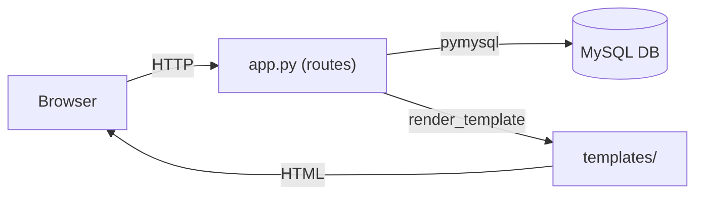

# Design Document: priority-bugs

## Overview

This document describes the technical design for four targeted bug fixes in the IT Asset Management Flask application. All changes are confined to `app.py` and the Jinja2 templates — no new libraries, frameworks, or database migrations are required.

The four fixes are:
1. **Intervention History** — expose completed interventions in a collapsible History section on `/interventions`.
2. **Asset status validation** — server-side guard in `add_intervention` that rejects requests for non-Inactive assets.
3. **Delete asset guard** — prevent deletion of assets that have associated intervention records.
4. **Secret key from environment** — load `app.secret_key` from `SECRET_KEY` env var instead of a hardcoded string.

---

## Architecture

The application follows a classic Flask MVC layout:

```
app.py               ← route handlers (controllers)
database.py          ← get_connection() helper
templates/           ← Jinja2 HTML templates (views)
static/              ← CSS, images
```

All four fixes live entirely within this existing structure. There are no new modules, no schema changes, and no new dependencies.



---

## Components and Interfaces

### Fix 1 — Intervention History

**File:** `app.py` — `interventions()` route

Current state: the route runs a single SELECT filtered to `WHERE i.status = 'Active'` and passes the result as `interventions`.

**Change:** add a second query that fetches completed interventions and pass it as a separate template variable.

```python
# existing query — unchanged
cursor.execute("""
    SELECT i.id, i.description, i.intervention_date, i.status,
           a.asset_tag, a.name as asset_name,
           t.name as technician_name
    FROM interventions i
    JOIN assets a ON i.asset_id = a.id
    JOIN technicians t ON i.technician_id = t.id
    WHERE i.status = 'Active'
    ORDER BY i.intervention_date DESC
""")
interventions = cursor.fetchall()

# new query
cursor.execute("""
    SELECT i.id, i.description, i.intervention_date, i.status,
           a.asset_tag, a.name as asset_name,
           t.name as technician_name
    FROM interventions i
    JOIN assets a ON i.asset_id = a.id
    JOIN technicians t ON i.technician_id = t.id
    WHERE i.status = 'Completed'
    ORDER BY i.intervention_date DESC
""")
completed_interventions = cursor.fetchall()
```

The `render_template` call is updated to pass `completed_interventions=completed_interventions`.

**File:** `templates/interventions.html`

A collapsible "History" section is appended below the existing active interventions card. It uses Bootstrap 5's collapse component (already loaded via `base.html`).

```html
<!-- History section — added below existing table-card div -->
<div class="mt-4">
    <button class="btn btn-secondary btn-sm" type="button"
            data-bs-toggle="collapse" data-bs-target="#historyCollapse">
        📋 History ({{ completed_interventions|length }})
    </button>
    <div class="collapse mt-3" id="historyCollapse">
        <div class="table-card">
            
            <table>
                <thead>
                    <tr>
                        <th>Asset</th>
                        <th>Technician</th>
                        <th>Description</th>
                        <th>Date</th>
                        <th>Status</th>
                    </tr>
                </thead>
                <tbody>
                    
                    <tr>
                        <td><span class="badge-asset">{{ i.asset_tag }}</span> {{ i.asset_name }}</td>
                        <td>{{ i.technician_name }}</td>
                        <td>{{ i.description }}</td>
                        <td>{{ i.intervention_date }}</td>
                        <td>
                            <span class="badge-status badge-completed">{{ i.status }}</span>
                        </td>
                        <!-- No action buttons in history rows -->
                    </tr>
                    
                </tbody>
            </table>
            
            <div class="empty-state">
                <p>No completed interventions recorded.</p>
            </div>
            
        </div>
    </div>
</div>
```

Flash messages also need to be wired into `interventions.html` (required for Fix 2). A flash block is added at the top of the `` body:

```html

<div class="alert alert-danger alert-dismissible fade show" role="alert">
    {{ msg }}
    <button type="button" class="btn-close" data-bs-dismiss="alert"></button>
</div>

```

---

### Fix 2 — Asset Status Validation on Intervention Creation

**File:** `app.py` — `add_intervention()` route

The current route immediately runs INSERT without checking whether the asset exists or is Inactive. The fix inserts a validation block between reading the form data and executing the INSERT.

`flash` must be imported — update the import line at the top of `app.py`:

```python
from flask import Flask, render_template, request, redirect, session, send_file, flash
```

The validation logic:

```python
@app.route('/interventions/add', methods=['POST'])
def add_intervention():
    if 'user' not in session:
        return redirect('/login')

    asset_id      = request.form['asset_id']
    technician_id = request.form['technician_id']
    description   = request.form['description']

    conn = get_connection()
    cursor = conn.cursor()

    # ── Validation ───────────────────────────────────────────────
    cursor.execute("SELECT status FROM assets WHERE id=%s", (asset_id,))
    asset = cursor.fetchone()

    if asset is None:
        cursor.close()
        conn.close()
        flash("Asset not found.")
        return redirect('/interventions'), 404

    if asset['status'] != 'Inactive':
        cursor.close()
        conn.close()
        flash("Asset is not available for intervention.")
        return redirect('/interventions'), 400
    # ─────────────────────────────────────────────────────────────

    cursor.execute("""
        INSERT INTO interventions (asset_id, technician_id, description, intervention_date, status)
        VALUES (%s, %s, %s, %s, 'Active')
    """, (asset_id, technician_id, description, date.today()))

    cursor.execute("UPDATE assets SET status='Maintenance' WHERE id=%s", (asset_id,))

    conn.commit()
    cursor.close()
    conn.close()
    return redirect('/interventions')
```

> **Note on redirect + status code:** Flask's `return redirect(url), status_code` pattern sets the HTTP status on the redirect response itself. The browser follows the redirect normally. The status code satisfies the requirement and is observable via HTTP clients or tests.

---

### Fix 3 — Delete Asset Guard

**File:** `app.py` — `delete_asset()` route

The current route deletes unconditionally. The fix adds a COUNT check first.

`flash` is already imported after Fix 2.

```python
@app.route('/delete-asset/<int:id>')
def delete_asset(id):
    if 'user' not in session:
        return redirect('/login')

    conn = get_connection()
    cursor = conn.cursor()

    # ── Guard ────────────────────────────────────────────────────
    cursor.execute(
        "SELECT COUNT(*) as cnt FROM interventions WHERE asset_id=%s", (id,)
    )
    count = cursor.fetchone()['cnt']

    if count > 0:
        cursor.close()
        conn.close()
        flash("Cannot delete asset: intervention records exist. Delete the interventions first.")
        return redirect('/assets')
    # ─────────────────────────────────────────────────────────────

    cursor.execute("DELETE FROM assets WHERE id=%s", (id,))
    conn.commit()
    cursor.close()
    conn.close()
    return redirect('/assets')
```

**File:** `templates/assets.html`

`assets.html` currently has no flash message display. A flash block is added at the top of the `` body, immediately after the `<style>` tag closes and before the `.page-header` div:

```html

<div class="alert alert-danger alert-dismissible fade show mt-3" role="alert">
    {{ msg }}
    <button type="button" class="btn-close" data-bs-dismiss="alert"></button>
</div>

```

No flash message is emitted on successful deletion, satisfying Requirement 3.4.

---

### Fix 4 — Secret Key from Environment Variable

**File:** `app.py` — startup configuration

`os` is not currently imported. Add it to the existing import block:

```python
import os
```

Replace the hardcoded secret key line:

```python
# Before
app.secret_key = "evolve_secret_key"

# After
app.secret_key = os.environ.get('SECRET_KEY', 'evolve_secret_key_dev')
```

The fallback value `'evolve_secret_key_dev'` makes the dev default clearly distinct from any production value.

**File:** `.env.example` (new file at project root)

```
SECRET_KEY=your-secret-key-here
```

`.gitignore` already contains a `.env` entry so no change is needed there. `.env.example` must not be listed in `.gitignore` (it contains no secrets and should be committed).

---

## Data Models

No database schema changes. The existing `interventions` and `assets` tables are used as-is.

Relevant columns referenced by these fixes:

| Table | Column | Type | Values used |
|---|---|---|---|
| `interventions` | `status` | VARCHAR | `'Active'`, `'Completed'` |
| `interventions` | `asset_id` | INT FK | references `assets.id` |
| `assets` | `status` | VARCHAR | `'Active'`, `'Inactive'`, `'Maintenance'` |
| `assets` | `id` | INT PK | — |

---

## Correctness Properties

*A property is a characteristic or behavior that should hold true across all valid executions of a system — essentially, a formal statement about what the system should do. Properties serve as the bridge between human-readable specifications and machine-verifiable correctness guarantees.*

### Property 1: Active/Completed separation is exhaustive and non-overlapping

*For any* set of interventions in the database, the list passed to the template as `interventions` and the list passed as `completed_interventions` shall together contain every intervention, and the two lists shall share no element (no intervention appears in both).

**Validates: Requirements 1.1**

---

### Property 2: History rows contain no action buttons

*For any* non-empty list of completed interventions, rendering `interventions.html` with that list shall produce HTML in the History section that contains no "Complete" link and no "Delete" button for any of those rows.

**Validates: Requirements 1.4**

---

### Property 3: Non-Inactive assets are always rejected

*For any* asset whose `status` is not `'Inactive'` (including `'Active'` and `'Maintenance'`), a POST to `/interventions/add` with that asset's ID shall be rejected with no INSERT into the `interventions` table and no UPDATE to the asset's status.

**Validates: Requirements 2.3**

---

### Property 4: Assets with interventions are never deleted

*For any* asset that has one or more rows in the `interventions` table, a request to `/delete-asset/<id>` shall leave the asset row present in the `assets` table and redirect to `/assets`.

**Validates: Requirements 3.2**

---

## Error Handling

| Scenario | Handler | Response |
|---|---|---|
| `asset_id` not found in assets | `add_intervention` validator | flash "Asset not found.", redirect `/interventions`, HTTP 404 |
| Asset status is not `'Inactive'` | `add_intervention` validator | flash "Asset is not available for intervention.", redirect `/interventions`, HTTP 400 |
| Asset has intervention records | `delete_asset` guard | flash "Cannot delete asset: intervention records exist. Delete the interventions first.", redirect `/assets` |
| `SECRET_KEY` env var not set | `os.environ.get` fallback | uses `'evolve_secret_key_dev'`, no exception |

All flash messages are displayed using Bootstrap `alert alert-danger` in their respective templates. The active interventions table and asset list remain fully functional in the presence of these error states.

---

## Testing Strategy

This feature is appropriate for property-based testing for the two universally-quantified guards (validation rejection and delete blocking). The history separation property is also universal. Template rendering properties are tested with generated data passed directly to the Jinja2 render call.

The testing library is **Hypothesis** (already present in the project's `.hypothesis/` directory).

**Unit tests** cover:
- Specific examples: happy-path intervention creation, successful asset deletion, complete-intervention redirect, fallback secret key behavior.
- Edge cases: empty `completed_interventions` list renders placeholder; `asset_id` for non-existent asset returns 404.

**Property tests** (minimum 100 iterations each, using Hypothesis):
- **Property 1** — generate random lists of intervention dicts with mixed statuses; call the route with a mocked DB and verify the two returned lists are non-overlapping and together exhaustive.
- **Property 2** — generate random lists of completed intervention dicts; render `interventions.html` via Flask's test client and assert no Complete/Delete button appears in `#historyCollapse`.
- **Property 3** — generate assets with `status` drawn from `['Active', 'Maintenance']`; POST to `/interventions/add`; assert no row was inserted and flash message equals "Asset is not available for intervention."
- **Property 4** — generate assets with 1–N associated intervention rows; call `/delete-asset/<id>`; assert the asset still exists in the DB.

Tag format for each property test: `# Feature: priority-bugs, Property N: <property_text>`

**Smoke tests** (single execution):
- `import os` present in `app.py`.
- `.env.example` exists at project root and contains `SECRET_KEY=your-secret-key-here`.
- `.gitignore` contains `.env` and does not contain `.env.example`.
- `app.secret_key` equals `os.environ.get('SECRET_KEY', 'evolve_secret_key_dev')` when no env var is set.
